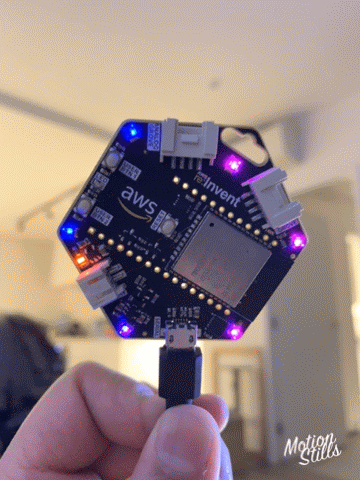

# ESP-IDF DOT-STAR LED Library
Tested on AWS ESP32 Lanyard made by [Accumulatos](https://github.com/accumulatos/lanyard/blob/master/hardware/%5BACC-AWSLY1%5D%20The%20AWS%20ESP32%20Lanyard%20SCHEMATICS%2026.11.2017.pdf) for [APA102-2020](https://www.adafruit.com/product/3341) type LED.



## Installation
Copy "dotstar" directory under components folder and paste it in your project's components directory.
Include it in your main.c file.
``` C
#include "../components/dotstar/include/dotstar.h"
```

## Basic Usage
Call the init function to assign the correct IO pins and to setup number of LEDs.
``` C
init_led(LED_SDA,LED_CLK,TOTAL_LEDS,DOTSTAR_RGB);
```

Use __setPixelColor()__ or __setPixel24bitColor()__ to set color to individual LEDs in a strip of LEDs.
``` C
setPixelColor(led_index,r,g,b);
setPixel24bitColor(led_index, color);
```

Finally call the following function to display the color on LEDs.
``` C
printLED();
```